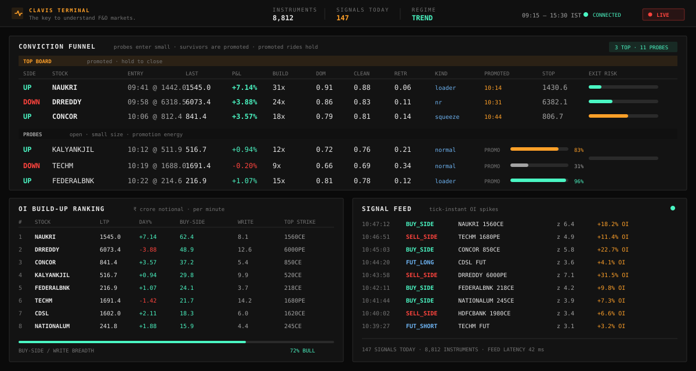
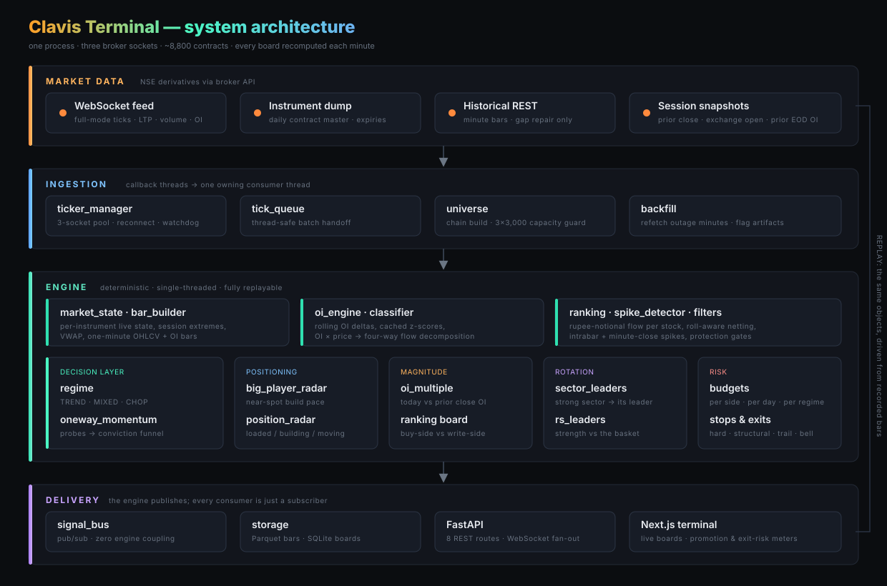
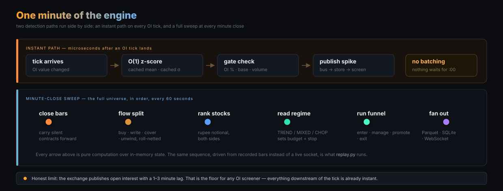
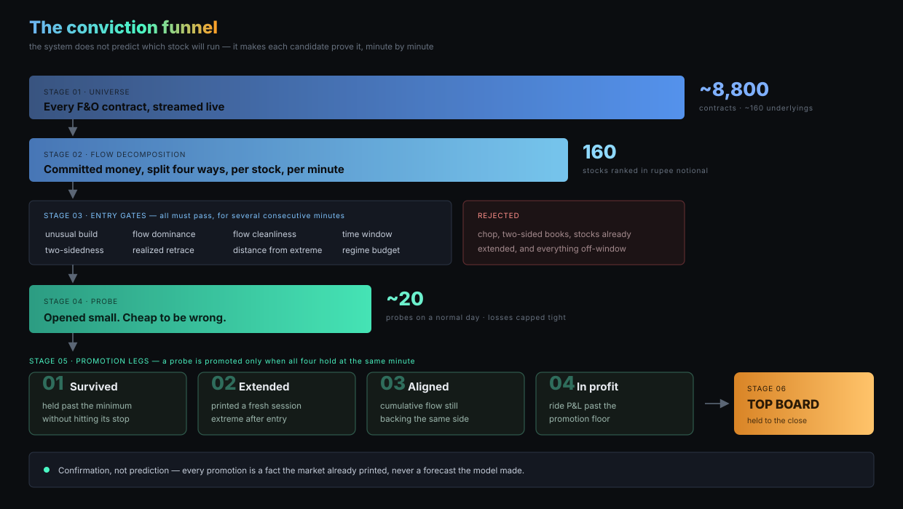
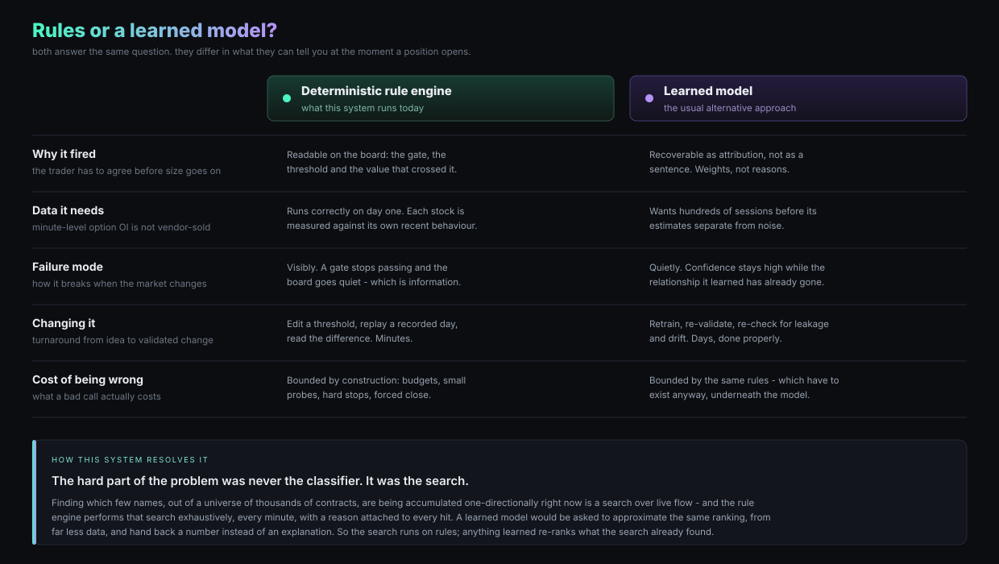
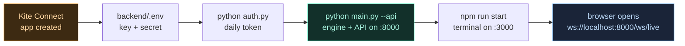
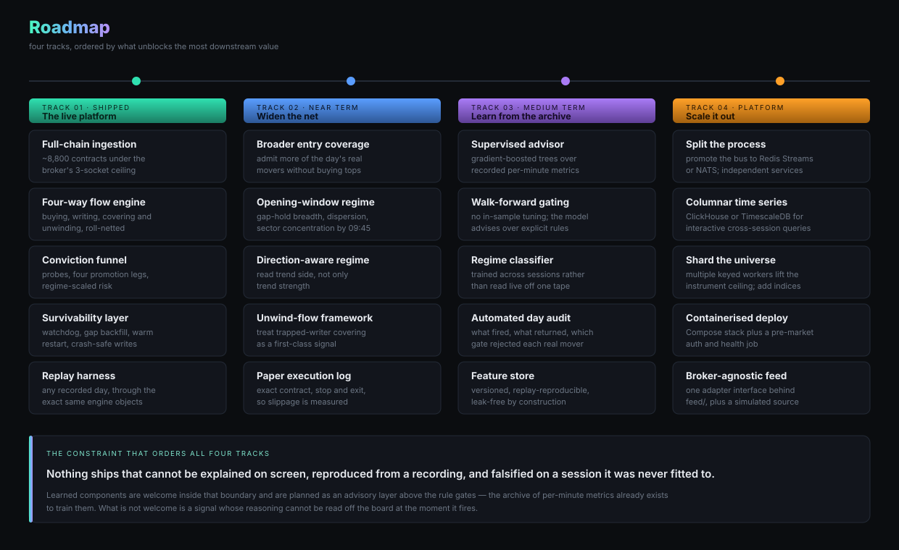

<div align="center">

# Clavis Terminal

### The key to understand F&O markets.

**A real-time open-interest intelligence terminal for the Indian derivatives market.**

Built on the official **Zerodha Kite Connect** API, it reads the entire option chain of the
NSE F&O universe tick by tick, works out where institutional money is actually being committed
rather than merely traded, and narrows roughly nine thousand live contracts down to the handful
of names being accumulated in one direction right now — while the session is still running.

`docker compose up` and it is on screen.

<br>

[](https://www.python.org/)
[](https://fastapi.tiangolo.com/)
[](https://nextjs.org/)
[](https://www.typescriptlang.org/)

[](https://kite.trade/)
[](https://docs.docker.com/compose/)
[](https://parquet.apache.org/)
[](https://www.sqlite.org/)
[](https://tailwindcss.com/)
[](LICENSE)

<br>



</div>

---

<div align="center">

| | | | |
|:--:|:--:|:--:|:--:|
| **~8,800** | **~160** | **~3.3 M** | **microseconds** |
| contracts streamed live | F&O underlyings tracked | instrument-minutes recorded per session | from OI tick to fired signal |
| **8** | **60 s** | **100 %** | **1** |
| decision boards on screen | full-universe sweep cadence | of every session replayable offline | machine, one API key |

</div>

---

## Table of contents

**Understanding it**
[Why most OI screeners fail](#why-most-oi-screeners-fail) ·
[Design principles](#design-principles) ·
[System architecture](#system-architecture) ·
[One minute of the engine](#one-minute-of-the-engine) ·
[The conviction funnel](#the-conviction-funnel) ·
[Rules or a learned model](#rules-or-a-learned-model) ·
[The boards](#the-boards)

**Running it**
[Data source — Kite Connect](#data-source--zerodha-kite-connect) ·
[Repository layout](#repository-layout) ·
[Data model](#data-model) ·
[API surface](#api-surface) ·
[Getting started](#getting-started) ·
[Running with Docker](#running-with-docker) ·
[Daily operating procedure](#daily-operating-procedure) ·
[Verifying the connection](#verifying-the-connection) ·
[Troubleshooting](#troubleshooting) ·
[Replay and validation](#replay-and-validation) ·
[Production engineering](#production-engineering) ·
[Scale and performance](#scale-and-performance)

**The rest**
[Roadmap](#roadmap) ·
[Note on the published source](#note-on-the-published-source) ·
[Disclaimer](#disclaimer)

---

## Why most OI screeners fail

Open interest is the only public number that tells you how much money is *committed* to a
position rather than merely passing through it. Volume says a trade happened. Open interest
says somebody is still standing there, exposed, overnight.

The catch is that the exchange publishes it as a raw total, per contract, with no direction
attached. Every open contract has a buyer and a seller. So a screener that ranks stocks by
"OI change" is ranking a number whose sign means nothing — and one that ranks by absolute
rupee flow will return the same five index-heavyweight names every single day, because they
are large, not because anything is happening in them.

Clavis Terminal treats open interest as a **flow** problem instead of a level problem.

For every contract in the universe it builds one-minute bars, measures the change in open
interest against that contract's own recent behaviour, pairs the change with the simultaneous
price change to infer which side initiated it, converts it to rupee notional, and aggregates
it per stock across four separate channels:

<div align="center">

| channel | what it means | reads as |
|:--|:--|:--:|
| **Call buying** | fresh long calls, OI up with premium up | bullish commitment |
| **Put writing** | fresh short puts, OI up with premium down | bullish commitment |
| **Put buying** | fresh long puts, OI up with premium up | bearish commitment |
| **Call writing** | fresh short calls, OI up with premium down | bearish commitment |
| **Short covering** | OI *down*, price up — trapped shorts buying back | exit fuel, directional |
| **Long unwinding** | OI *down*, price down — longs giving up | exit fuel, directional |

</div>

That decomposition is the foundation the entire terminal is built on. Everything above it —
the ranking, the radars, the funnel — is an opinion about the same underlying quantity:
*where is committed money going, right now, in this stock, relative to how this stock normally
behaves.*

The second half of the answer matters as much as the first. A mid-cap building four times its
own typical minute-flow is a genuine event. The same rupee figure in a large private bank is
an ordinary Tuesday. Every magnitude in this system is normalised against the stock's own
trailing baseline before it is allowed to rank — which is precisely why the board surfaces
names that a flat rupee ranking structurally cannot find.

---

## Design principles

<table>
<tr>
<td width="33%" valign="top">

### 01 · Confirm, don't predict

Entry-time features do not separate the names that run from the names that fade. Build size,
flow dominance and radar strength look statistically identical at the entry minute for both
groups.

So the system does not forecast. It opens small positions and makes each one **earn**
promotion by continuing to be right.

</td>
<td width="33%" valign="top">

### 02 · Being wrong must be cheap

Every candidate opens at reduced size, under a per-side and per-day budget that shrinks as the
tape gets choppier, behind a hard stop and a forced close before the bell.

The asymmetry is the strategy: **many small, bounded rejections; a few concentrated,
fully-ridden survivors.**

</td>
<td width="33%" valign="top">

### 03 · Explainable or it doesn't ship

Every signal on screen carries the gate it passed, the threshold it crossed and the value that
crossed it.

Nothing fires that a human cannot read, argue with, and override. That constraint is not a
limitation of the design — it *is* the design.

</td>
</tr>
<tr>
<td valign="top">

### 04 · Reproducible by construction

Every session is recorded in full. Any recorded day can be pushed back through the exact same
engine objects — same state machine, same ranking pass, same funnel — with no market and no
broker connection.

A change is not "an improvement" until it has been replayed against a day it was never fitted
to.

</td>
<td valign="top">

### 05 · Survive the session, unattended

Feeds stall. Networks drop. Processes die at 11:04.

A material share of this codebase is watchdogs, gap repair, crash-safe writes, warm restart
and single-instance locking — because a screener that goes quietly stale is worse than no
screener at all.

</td>
<td valign="top">

### 06 · Normalise before you rank

Absolute rupee flow ranks the largest companies. Flow relative to a stock's own trailing
behaviour ranks the *unusual* ones.

Every board in this system divides by the stock's own baseline before sorting. That single
decision is what makes the output actionable instead of decorative.

</td>
</tr>
</table>

---

## System architecture

<div align="center">

</div>

Four layers, deliberately decoupled.

The engine never knows that a dashboard exists. It publishes to an in-process pub/sub bus, and
the console printers, the SQLite store and the API server are all just subscribers. Adding a
Telegram alerter, a webhook, or a broker order-router is a new subscriber — not an engine
change, not a refactor, not a risk to the hot path.

Concurrency is handled by removing it. Broker WebSocket callbacks run on their own threads and
do exactly one thing: hand ticks to a thread-safe queue. A single consumer thread owns all
mutable state. That eliminates an entire category of bug that would otherwise be very hard to
reproduce and very expensive to discover live.

The cost of the hot path is kept flat on purpose. Z-scores are computed against cached rolling
mean and standard deviation, so the per-tick check is **O(1)** rather than a window
recomputation. That is what makes instant detection across nine thousand contracts affordable
on a single desktop machine.

---

## One minute of the engine

<div align="center">

</div>

Two detection paths run side by side.

The **instant path** fires the moment an OI tick lands. It does not wait for the minute to
close, it does not batch, and it does not queue behind the ranking sweep. A contract whose open
interest jumps abnormally against its own baseline is on the screen before the minute it
happened in has ended.

The **minute sweep** does the work that needs the whole universe in one consistent snapshot:
close every bar, carry forward the contracts that traded nothing, decompose flow four ways,
rank all stocks in rupee notional, read the day regime, then run the funnel and every
supporting board — in that order, with the outputs of each feeding the next.

**One honest limit, stated up front:** the exchange disseminates open interest with a lag of
one to three minutes. That is the floor for *any* OI-based screener, this one included. It is
also exactly why the instant path exists — the software contributes microseconds to a delay
the exchange has already spent minutes on, and there is no version of this problem where
adding batching helps.

---

## The conviction funnel

<div align="center">

</div>

This is the central design decision, and the one most worth understanding.

**The system does not try to pick winners at the moment of entry, because that does not work.**
At the entry minute, the names that go on to trend and the names that immediately fade have
indistinguishable distributions on every feature worth measuring — build magnitude, flow
dominance, near-spot participation. The losers often score *better* on dominance.

So the funnel stops trying to be a prediction layer and becomes a **confirmation layer**.

A stock that clears the entry gates opens as a **probe**: small, cheap, tightly stopped,
counted against a daily budget. From there it is not judged on what it looked like — it is
judged on what it keeps doing. Four legs, all of which must hold at the same minute:

<div align="center">

| leg | question | why this one |
|:--:|:--|:--|
| **01** | Has it survived long enough without hitting its stop? | Weak setups eliminate themselves fast. Time alone removes a large share of them at minimal cost. |
| **02** | Has it printed a fresh session extreme *since entry*? | Distinguishes a position that is still going from one that stalled the minute you joined it. |
| **03** | Is cumulative flow still backing the same side? | Confirms the money that caused the move has not started leaving through the door it came in. |
| **04** | Is the ride actually in profit past the floor? | The market's own verdict, and the only leg that cannot be argued with. |

</div>

Clear all four and the probe is **promoted to the Top Board** — sticky for the day, held to
the close. The board is small on purpose. Reaching it is meant to be difficult.

Two live meters make the state legible while it happens: a **promotion energy bar** showing how
many legs a probe has satisfied, and an **exit-risk meter** showing how close a ride is to the
nearest of its stop, its trail, or the closing bell. Both are read-outs. Neither drives a
decision — the rules do that, and the meters just let a human see the rules thinking.

Above all of it sits the **day-regime meter**, reading the cleanliness breadth of the live
futures tape and classifying the session as TREND, MIXED or CHOP. The regime sets the daily
entry budget per side, the advisory size multiplier and the hard-stop distance — and on a chop
day it restricts entries to structural setups only. The single most reliable way to improve a
day's outcome is to take fewer positions on the days that punish them, and that is a decision
the system makes on its own, from the tape, before most of the damage is available to be done.

---

## Rules or a learned model

<div align="center">

</div>

This question comes up immediately, so here is the position in full.

**The hard part of this problem was never classification. It was search.**

Deciding whether one particular setup is good is a small question. Finding *which few names*,
out of nine thousand live contracts across a hundred and sixty stocks, are being accumulated
one-directionally at 09:47 — that is a search problem over live flow, and it is the part that
actually determines whether the day works.

The rule engine performs that search **exhaustively, every minute, over the entire universe,
with a reason attached to every hit.** Nothing is sampled, nothing is approximated, and no
candidate is skipped because a model assigned it a low prior. A learned ranker would be asked
to approximate the same ordering, from far less data, and would hand back a score instead of an
explanation.

Two structural facts make that trade a poor one *at this stage of the system's life*:

- **The data does not exist yet in the quantity a model wants.** Minute-level option open
  interest is not sold by vendors. It has to be self-recorded, one session at a time. A rule
  that measures each stock against its own trailing baseline works correctly on day one; a
  model that has to learn cross-sectional structure from scratch needs hundreds of sessions
  before its estimates separate from noise.
- **Silent failure is the expensive kind.** When a rule stops passing, the board goes quiet,
  and quiet is information. When a learned model's relationship decays, its confidence
  frequently does not — it keeps producing well-formed, high-scoring, wrong answers, and the
  first honest signal is the drawdown.

**None of that says learning has no place here — it says learning is the second layer, not the
first.** Every per-minute metric the engine computes is already recorded to disk, which means
the archive *is* a labelled training set, growing every session, leak-free by construction
because replay can reproduce any day exactly as it was seen live. The planned shape is
gradient-boosted trees under walk-forward validation, learning selectively, sitting **above**
the rule gates as an advisor that re-ranks candidates the deterministic search has already
found and explained.

That ordering is not a compromise. A model that re-ranks an exhaustive, explainable candidate
set is strictly better positioned than one asked to do the search itself — it inherits the
coverage, keeps the audit trail, and cannot silently drop a name it never scored.

> **The search runs on rules. Learning is queued to re-rank what the search already found.**

---

## Data source — Zerodha Kite Connect

<div align="center">

[](https://kite.trade/)
[](https://github.com/zerodha/pykiteconnect)

</div>

**Every number in this terminal comes from the official Zerodha Kite Connect API.** There is no
scraping, no unofficial endpoint, no third-party data vendor and no delayed public feed anywhere
in the pipeline. The system is built directly against the broker's own market-data interface and
respects its documented limits by design rather than by luck.

Exactly four Kite capabilities are used:

<table>
<tr><th align="left" width="24%">Kite capability</th><th align="left" width="28%">Used for</th><th align="left">Where</th></tr>
<tr>
  <td><b>KiteTicker WebSocket</b><br><sub>full mode</sub></td>
  <td>The live tick stream — last price, traded volume and <b>open interest</b> on every contract in the universe.</td>
  <td><code>feed/ticker_manager.py</code>, <code>feed/tick_queue.py</code></td>
</tr>
<tr>
  <td><b>Instruments dump</b><br><sub>REST</sub></td>
  <td>The daily contract master: strikes, expiries, lot sizes and instrument tokens, used to assemble each stock's option chain and near-month future.</td>
  <td><code>universe.py</code></td>
</tr>
<tr>
  <td><b>Historical data</b><br><sub>REST</sub></td>
  <td>Minute-bar backfill, used <i>only</i> to repair a window the live socket missed. Never used as a primary source.</td>
  <td><code>feed/backfill.py</code></td>
</tr>
<tr>
  <td><b>Session / login</b><br><sub>REST</sub></td>
  <td>The daily <code>request_token</code> → <code>access_token</code> exchange, written straight back into <code>.env</code>.</td>
  <td><code>auth.py</code></td>
</tr>
</table>

### The limits this imposes, and how the system respects them

| Kite constraint | How Clavis Terminal handles it |
|:--|:--|
| **3 WebSocket connections per API key** | `ticker_manager.py` runs a pool of exactly three, never more, and treats the pool as a single logical feed. |
| **3,000 instruments per connection** | `universe.py` enforces a hard capacity budget below 3 × 3,000 and trims the furthest out-of-the-money strikes first, so the near-spot chain — where the signal lives — is never sacrificed. |
| **~3 requests/second on historical REST** | `backfill.py` is rate-limited below that ceiling and only ever runs after a detected gap. |
| **Access token expires daily (~07:30 IST)** | `auth.py` performs the exchange once each morning and writes the token to `.env`; the live loop re-checks token validity before blaming the network for a stall. |
| **Only one process may hold the three sockets** | A PID-checked single-instance lock refuses a second screener rather than letting two terminals show different partial universes. |

> **You need your own Kite Connect subscription to run this live.** It is a paid developer
> product from Zerodha, separate from a trading account. Sign up at
> **[kite.trade](https://kite.trade/)** — setup is covered step by step in
> [Getting started](#getting-started) below. Without one, the dashboard still runs in demo mode
> against generated fixtures, and `replay.py` still runs against any recording you have.

---

## The boards

Eight surfaces, each answering one question, all recomputed every minute and all persisted.

<table>
<tr><th align="left" width="24%">Board</th><th align="left">What it answers</th></tr>
<tr><td><b>Conviction Funnel</b></td><td>Which stocks are being accumulated one-directionally right now, which of those have proven themselves, and how close each is to promotion or removal.</td></tr>
<tr><td><b>OI Build-up Ranking</b></td><td>Which stocks lead the universe on buy-side and write-side option flow this minute, in rupee crore, with the dominant strike on each side.</td></tr>
<tr><td><b>Big Player Radar</b></td><td>Where near-spot strike OI is building faster than that contract's own normal pace — positioning, before it becomes price.</td></tr>
<tr><td><b>Position Radar</b></td><td>Per stock, where in the chain size is accumulating, and whether the name is <i>loaded but still quiet</i>, <i>building</i>, or <i>already moving</i>.</td></tr>
<tr><td><b>OI Build-up Multiple</b></td><td>Today's fresh open interest measured against the prior session's close, ranked by multiple rather than by absolute size — the small-base breakouts.</td></tr>
<tr><td><b>Sector Leaders</b></td><td>The strongest NSE sector groups and the one-way leaders inside them, for rotation that starts at the sector and ends at a single name.</td></tr>
<tr><td><b>Relative Strength Leaders</b></td><td>The day's top names by strength against an equal-weight basket, snapshotted once at a fixed decision time.</td></tr>
<tr><td><b>Signal Feed</b></td><td>The raw spike stream, tick-instant, with z-score and OI percentage on every line.</td></tr>
</table>

---

## Repository layout

```
clavis-terminal/
├── docker-compose.yml           engine + API + terminal, one command
├── backend/
│   ├── Dockerfile               python:3.11-slim, data and .env bind-mounted
│   ├── main.py                  orchestrator: auth → universe → feed → loop → EOD
│   ├── api.py                   FastAPI REST + WebSocket bridge
│   ├── auth.py                  daily Kite login, token written to .env
│   ├── config.py                every path, window and threshold
│   ├── universe.py              option chain + futures resolution, capacity guard
│   ├── replay.py                offline replay of a recorded session
│   ├── stocks.txt               the monitored symbol list
│   ├── engine/
│   │   ├── market_state.py      per-instrument live state, session extremes, VWAP
│   │   ├── bar_builder.py       one-minute OHLCV + OI bars
│   │   ├── oi_engine.py         rolling OI deltas and cached z-scores
│   │   ├── classifier.py        OI × price → build-up / unwinding types
│   │   ├── spike_detector.py    composite spike signals, both paths
│   │   ├── ranking.py           four-way flow, roll-aware netting, rupee notional
│   │   ├── filters.py           straddle pin, OI wall runway, VWAP, relative volume
│   │   ├── regime.py            TREND / MIXED / CHOP day meter
│   │   ├── oneway_momentum.py   the conviction funnel
│   │   ├── big_player_radar.py  near-spot strike build pace
│   │   ├── position_radar.py    per-stock accumulation map
│   │   ├── oi_multiple.py       today's OI vs prior close, ranked by multiple
│   │   ├── rs_leaders.py        relative-strength leaders (shadow board)
│   │   └── sector_leaders.py    sector rotation leaders (shadow board)
│   ├── feed/
│   │   ├── ticker_manager.py    three-socket pool, reconnect, stall watchdog
│   │   ├── tick_queue.py        thread-safe callback → engine bridge
│   │   └── backfill.py          historical REST gap repair
│   ├── sinks/
│   │   ├── signal_bus.py        pub/sub hub + console printers
│   │   ├── storage.py           Parquet bar writer + SQLite store with migrations
│   │   └── baselines.py         cross-day per-stock flow baselines
│   └── tests/
│       └── test_oneway.py       end-to-end smoke test of the funnel
├── dashboard/
│   ├── Dockerfile               multi-stage build → Next.js standalone runtime
│   ├── app/                     Next.js 14 App Router entry, layout, global styles
│   ├── components/              one component per board
│   ├── hooks/
│   │   ├── useWebSocket.ts      reconnecting client with backoff
│   │   └── useLiveData.ts       reducer mapping socket frames → app state
│   └── lib/                     shared types and demo-mode fixtures
└── docs/assets/                 architecture, funnel, pipeline and roadmap diagrams
```

---

## Data model

### Recorded bars — Parquet

`backend/data/bars/{YYYY-MM-DD}/part_####.parquet`

Written by a buffered background thread into numbered part files, so an unexpected shutdown at
any point costs at most one flush interval and never corrupts an existing part. Each row is one
instrument-minute:

| column | meaning |
|---|---|
| `minute` | bar timestamp |
| `token`, `tradingsymbol`, `underlying`, `kind`, `strike`, `expiry` | instrument identity |
| `open`, `high`, `low`, `close` | price |
| `volume`, `oi`, `oi_delta` | traded volume, open interest, change in open interest |
| `backfilled` | set when the row was repaired from historical REST rather than the live feed |

### Signals and boards — SQLite (WAL)

`backend/data/signals/signals.sqlite`

| table | contents |
|---|---|
| `signals` | every fired spike, with score, z-score and OI percentage |
| `rankings` | the per-minute per-stock flow ranking snapshot |
| `oneway_movers` | funnel rows: entries, open minutes, promotions and exits |
| `big_player_radar` | near-spot build-pace flags |
| `position_builds` | per-stock accumulation state |
| `oi_multiple_board` | OI multiple rows against the prior close base |
| `sector_leaders`, `rs_leaders` | shadow board snapshots |
| `trade_ideas`, `momentum_picks`, `early_entries`, `best_picks` | earlier generations of the decision surface, retained for audit |
| `feed_gaps` | recorded outage windows, so later analysis knows which minutes are artifact |

Schema changes ship as additive `PRAGMA table_info` + `ALTER TABLE` migrations that run at
startup. An existing database is never rebuilt, never dropped, never lost.

### Session metadata

`backend/data/meta/` holds the daily instrument snapshot, per-token day references (previous
close and exchange open, learned from live ticks), the prior-session end-of-day OI snapshot, the
single-instance lock, and `flow_baseline.csv` — a trailing-window median of each stock's own
typical minute flow.

That last file is what makes *"unusual **for this stock**"* a computable statement rather than a
slogan.

---

## API surface

FastAPI, started in-process with the screener via `--api`.

### REST

| method | route | returns |
|---|---|---|
| `GET` | `/api/status` | market open, instrument count, signals today, feed health |
| `GET` | `/api/signals/today` | today's spike signals |
| `GET` | `/api/rankings/latest` | most recent per-stock flow ranking |
| `GET` | `/api/oneway/latest` | current funnel state — top board and probes |
| `GET` | `/api/radar/latest` | near-spot build-pace flags |
| `GET` | `/api/position/latest` | per-stock accumulation map |
| `GET` | `/api/oimult/latest` | OI multiple board |
| `GET` | `/api/sector/latest` | sector leader board |

### WebSocket

`ws://localhost:8000/ws/live`

Sends a full state snapshot on connect, then incremental frames. The bridge moves rows from the
synchronous engine thread onto an asyncio queue and fans them out to every connected browser at
a fixed tick, with a periodic status frame so the dashboard's LIVE indicator flips at the open
and the close without needing a reconnect.

```jsonc
{ "type": "status",   "data": { "market_open": true, "instruments": 8812, "feed_down": false } }
{ "type": "ranking",  "data": [ /* per-stock flow rows */ ] }
{ "type": "oneway",   "data": [ /* funnel rows */ ] }
{ "type": "signal",   "data": { /* one spike */ } }
{ "type": "radar",    "data": [ /* near-spot flags */ ] }
{ "type": "sector",   "data": [ /* sector leaders */ ] }
```

---

## Getting started

Two ways to run it. **[Docker](#running-with-docker)** is one command and needs nothing installed
but Docker itself. The native path below gives you a live Python environment for editing rules
and running replays.

<div align="center">



</div>

### Prerequisites

| | |
|:--|:--|
| **Python** | 3.11 or newer |
| **Node.js** | 18 or newer |
| **Kite Connect** | a paid developer subscription with API key and secret — [kite.trade](https://kite.trade/) |
| **OS** | Windows, macOS or Linux — the engine is pure Python, the dashboard is pure Node |

### Step 0 · Get your Kite Connect credentials

This is the only step that happens outside the repository, and it is a one-time setup.

1. Go to **[developers.kite.trade](https://developers.kite.trade/)** and sign in with your
   Zerodha account.
2. **Create a new app.** Type: *Connect*. Give it any name.
3. Set the **Redirect URL**. Kite sends you here after login with the `request_token` attached.
   Anything you can read the address bar of works — `http://127.0.0.1/` is the simplest choice
   for a local setup, and nothing needs to be listening on it.
4. Subscribe to the app. Kite Connect is billed monthly and is **separate from your trading
   account**.
5. Copy the **API key** and **API secret** from the app page. These two values never change and
   never leave your machine.

> **A note on how the daily login works.** Kite issues a short-lived `access_token` that expires
> around 07:30 IST every morning. You cannot skip this, and it cannot be automated away — the
> exchange requires an interactive login. `auth.py` reduces it to: open a URL, log in, paste one
> string back. Roughly fifteen seconds, once a day.

### Step 1 · Backend

```bash
git clone https://github.com/<your-user>/Clavis-Terminal.git
cd Clavis-Terminal/backend

python -m venv .venv
# Windows
.venv\Scripts\activate
# macOS / Linux
source .venv/bin/activate

pip install -r requirements.txt
```

Create `backend/.env` from the template:

```bash
cp .env.example .env
```

```ini
KITE_API_KEY=your_api_key
KITE_API_SECRET=your_api_secret
KITE_ACCESS_TOKEN=
```

> `.env` is git-ignored and must stay that way. Leave `KITE_ACCESS_TOKEN` **blank** — `auth.py`
> writes it for you and rewrites it every morning.

### Step 2 · Choose what to watch

Edit `backend/stocks.txt` — one NSE F&O underlying per line, comments with `#`:

```
RELIANCE
HDFCBANK
TATAMOTORS
# DRREDDY      <- commented out, will be skipped
```

On boot the universe builder resolves each symbol against Kite's instrument dump, assembles its
nearest-expiry option chain plus near-month future, and reports anything it could not find. If
the resulting universe would exceed the 3 × 3,000 instrument ceiling, it trims the furthest
out-of-the-money strikes until it fits — the near-spot chain is never trimmed.

### Step 3 · Verify before going live

```bash
python -m tests.test_oneway
```

Expected output — nine checks, all passing, no market connection required:

```
  [PASS] the clean riser is entered
  [PASS] the choppy name is rejected
  [PASS] entries are directional
  [PASS] every mover carries a score
  [PASS] open rides report live P&L
  [PASS] the promotion meter stays in range
  [PASS] baseline samples are collected
  [PASS] a sustained winner reaches the top board
  [PASS] promotion never precedes its P&L floor

9/9 checks passed
```

### Step 4 · Connect to Kite

```bash
python auth.py
```

```
--- Kite daily login ---
1. Open this URL in your browser and log in:
   https://kite.zerodha.com/connect/login?api_key=...&v=3
2. After login you land on your redirect URL. Copy the
   `request_token` query parameter from that URL.

Paste request_token here: _
```

After logging in, your browser lands on the redirect URL you configured, and the address bar will
look like this:

```
http://127.0.0.1/?action=login&type=login&status=success&request_token=AbCdEf123456
                                                          └──────── copy this ────────┘
```

Paste it back. You should see:

```
Login OK - welcome <your name>.
Access token saved to .../backend/.env
```

That token is now good until roughly 07:30 tomorrow.

### Step 5 · Start the engine

```bash
python main.py --api
```

| flag | effect |
|:--|:--|
| `--api` | start the FastAPI REST + WebSocket server in-process on port 8000 |
| `--now` | begin immediately instead of waiting for the 09:15 bell |
| `--api-port 8000` | serve the API on a different port |
| `--no-warm` | skip rebuilding state from bars already recorded today |

A healthy boot log looks like this:

```
INFO  Token valid - logged in as <your name>
INFO  Universe: 163 stocks, 8,812 instruments (3 connections)
INFO  Flow baselines loaded: 98 stocks (all-strikes), 98 (near-spot)
INFO  Single-instance lock acquired (PID 24188)
INFO  API server listening on http://0.0.0.0:8000
INFO  Waiting for market open 09:15 ...
```

### Step 6 · Start the terminal

```bash
cd ../dashboard
npm install
cp .env.local.example .env.local
```

```ini
NEXT_PUBLIC_DEMO=false
NEXT_PUBLIC_API_WS=ws://localhost:8000/ws/live
```

```bash
npm run build
npm run start          # http://localhost:3000
```

Open **http://localhost:3000**. The connection dot in the header turns green when the browser's
WebSocket attaches, and the pulsing red **LIVE** badge appears only when the socket is connected
*and* the market is genuinely open — it cannot be faked, which is the point.

> **No Kite subscription yet?** Set `NEXT_PUBLIC_DEMO=true` and run `npm run start` on its own.
> The entire interface renders against generated fixtures with no backend at all.

> **Editing the interface?** Use `npm run dev`. For live sessions always use the production
> build — development mode ships an unoptimised React build and visibly lags at this row
> throughput.

---

## Running with Docker

The whole stack — engine, API and terminal — comes up with one command. Nothing needs to be
installed except Docker.

```bash
git clone https://github.com/<your-user>/Clavis-Terminal.git
cd Clavis-Terminal

cp backend/.env.example backend/.env
# put your KITE_API_KEY and KITE_API_SECRET in backend/.env
```

### Daily token, inside the container

`auth.py` is interactive, so run it as a one-off with a TTY attached. The token it writes lands in
your host `backend/.env` because that file is bind-mounted:

```bash
docker compose run --rm backend python auth.py
```

### Bring the stack up

```bash
docker compose up -d --build
```

| service | port | what it is |
|:--|:--:|:--|
| `backend` | **8000** | engine + FastAPI REST + WebSocket |
| `dashboard` | **3000** | the terminal interface |

Then open **http://localhost:3000**.

### Everyday commands

```bash
docker compose logs -f backend        # follow the engine log
docker compose logs -f dashboard      # follow the web server
docker compose restart backend        # restart the engine, keep recordings
docker compose down                   # stop everything (the data volume survives)
docker compose down -v                # stop and DELETE all recordings

# run a replay inside the container
docker compose run --rm backend python replay.py --date 2026-01-15

# run the smoke test
docker compose run --rm backend python -m tests.test_oneway
```

### What is mounted, and why

| mount | reason |
|:--|:--|
| `./backend/.env` → `/app/.env` | `auth.py` writes the daily token here; it must persist on the host and never enter the image |
| `clavis-data` volume → `/app/data` | Parquet recordings, the SQLite database and session metadata survive rebuilds |
| `./backend/stocks.txt` → `/app/stocks.txt` *(read-only)* | change the watchlist without rebuilding the image |

> **One gotcha worth knowing.** `NEXT_PUBLIC_API_WS` is baked into the browser bundle at build
> time, and the socket is opened by *your browser*, not by the dashboard container. So it must be
> an address the browser can reach — `ws://localhost:8000/ws/live`, not `ws://backend:8000/...`.
> Serving from another host? Rebuild with your own value:
>
> ```bash
> NEXT_PUBLIC_API_WS=ws://192.168.1.50:8000/ws/live docker compose up -d --build dashboard
> ```

> **Demo mode in Docker** — no Kite subscription required:
>
> ```bash
> NEXT_PUBLIC_DEMO=true docker compose up -d --build dashboard
> ```

---

## Daily operating procedure

```mermaid
gantt
    title Trading day
    dateFormat HH:mm
    axisFormat %H:%M
    section Pre-market
    python auth.py            :done, a, 08:45, 5m
    python main.py --api      :active, b, 09:05, 10m
    npm run start             :active, c, 09:05, 10m
    section Session
    Feed live, boards update  :d, 09:15, 375m
    Prime detection window    :crit, e, 09:25, 55m
    section Post-market
    EOD flush + finalize      :f, 15:30, 5m
    Replay and review         :g, 15:40, 30m
```



```bash
# 1. Broker access tokens expire daily, around 07:30 IST.
#    Log in once and paste the request_token back into the prompt.
python auth.py

# 2. Start the screener before the bell. It waits for 09:15 by itself.
python main.py --api                 # add --now to start immediately
python main.py --api --api-port 8000 # explicit port
python main.py --api --no-warm       # skip rebuilding state from today's bars

# 3. Serve the dashboard from the production build.
cd ../dashboard && npm run start
```

> **Start before 09:10.** Option contracts cannot be backfilled once the session is running, so
> a late start permanently loses the opening window — which is exactly the window the earliest
> entry paths depend on. `main.py` warns loudly on a late start, and the regime meter caps the
> day at MIXED rather than reporting a trend it never actually observed.

> **Run one instance.** A single screener consumes all three WebSocket connections the broker
> allows per API key. A second process would silently split the universe between two terminals
> showing different partial data, so startup takes a single-instance lock and refuses to run
> twice. A stale lock from a crashed run is detected and taken over automatically.

---

## Verifying the connection

Six checks. If all six pass, the pipeline is healthy end to end.

| # | Check | Where | What you want to see |
|:--:|:--|:--|:--|
| 1 | **Broker token accepted** | engine log | `Token valid - logged in as <name>` |
| 2 | **Universe assembled** | engine log | `Universe: N stocks, ~8,800 instruments (3 connections)` |
| 3 | **API answering** | `curl http://localhost:8000/api/status` | JSON with `"instruments"` non-zero |
| 4 | **Ticks arriving** | engine log | per-minute ranking tables printing after 09:15 |
| 5 | **Browser attached** | dashboard header | connection dot **green**, not amber |
| 6 | **Genuinely live** | dashboard header | pulsing red **LIVE** badge — shown only when the socket is connected *and* the market is open |

```bash
# quick end-to-end probe from any terminal
curl -s http://localhost:8000/api/status
# {"market_open":true,"instruments":8812,"signals_today":147,"feed_down":false}

curl -s http://localhost:8000/api/rankings/latest | head -c 400
curl -s http://localhost:8000/api/oneway/latest   | head -c 400
```

---

## Troubleshooting

<table>
<tr><th align="left" width="30%">Symptom</th><th align="left">Cause and fix</th></tr>
<tr>
  <td><code>KITE_API_KEY / KITE_API_SECRET missing</code></td>
  <td><code>backend/.env</code> is absent or empty. Copy it from <code>.env.example</code> and fill both values. Under Docker, confirm the bind mount by running <code>docker compose run --rm backend cat /app/.env</code>.</td>
</tr>
<tr>
  <td><code>Saved access token is expired/invalid</code></td>
  <td>Normal — tokens die daily around 07:30 IST. Run <code>python auth.py</code> again. This is not an error, it is the design of the broker API.</td>
</tr>
<tr>
  <td>Login page loads but the redirect goes nowhere</td>
  <td>Expected. Nothing needs to be listening on your redirect URL — you are only reading <code>request_token</code> out of the address bar. A browser error page still shows the URL.</td>
</tr>
<tr>
  <td>Engine refuses to start, mentions a lock</td>
  <td>Another screener already holds the three sockets. Stop it. If a previous run crashed, the stale lock is detected and taken over automatically — delete <code>data/meta/screener.lock</code> only if it genuinely is not.</td>
</tr>
<tr>
  <td>Dashboard shows <b>Backend disconnected</b></td>
  <td>The engine is not running, is on a different port, or <code>NEXT_PUBLIC_API_WS</code> points somewhere the browser cannot reach. Confirm with <code>curl http://localhost:8000/api/status</code> first.</td>
</tr>
<tr>
  <td>Dashboard looks alive but numbers never change</td>
  <td>You are probably in demo mode. Set <code>NEXT_PUBLIC_DEMO=false</code> and rebuild — the value is inlined into the client bundle at build time, so a restart alone will not pick it up.</td>
</tr>
<tr>
  <td>Red <code>feed down</code> banner mid-session</td>
  <td>The watchdog saw no ticks past the stale threshold and is forcing reconnects. It re-checks the token before blaming the network. Once the feed returns, the missed window is backfilled and flagged.</td>
</tr>
<tr>
  <td>Fewer instruments than expected</td>
  <td>The capacity guard trimmed the universe to fit 3 × 3,000. Shorten <code>stocks.txt</code>. Far out-of-the-money strikes are dropped first, so the near-spot chain is intact.</td>
</tr>
<tr>
  <td>Some symbols missing entirely</td>
  <td>They did not resolve in Kite's instrument dump — usually a rename, or a name no longer in the F&O segment. The boot log names each one.</td>
</tr>
<tr>
  <td>Browser tab crawls during a busy session</td>
  <td>You are on <code>npm run dev</code>. Run <code>npm run build &amp;&amp; npm run start</code>.</td>
</tr>
</table>

---

## Replay and validation

Every session is recorded in full, which means the engine can be re-run over any recorded day
with no market and no broker connection.

```bash
python replay.py --date 2026-01-15                  # replay a recorded day
python replay.py --date 2026-01-15 --rank-every 5   # ranking cadence, minutes
python replay.py --date 2026-01-15 --save           # persist replayed output
python replay.py --date 2026-01-15 --save-baseline  # rebuild flow baselines
```

Replay drives **exactly the same engine objects** as live trading — the same `market_state`, the
same ranking pass, the same funnel. A threshold change is therefore evaluated against real
recorded market behaviour, not against a simulation of it.

That distinction is not academic. A synthetic feed can ramp open interest in ways real strikes
physically cannot, and a rule that passes a synthetic test can turn out to be *mathematically
impossible* on live data — a mistake that is very cheap to make and very expensive to discover
during a session. The standing rule in this project is that detection logic is validated on real
recordings, and synthetic data is used only to prove that plumbing is wired.

Replay also produces a forward-return report, measuring what price actually did in the window
after each signal fired.

---

## Production engineering

This system has to survive a live market session unattended, so a large share of the codebase is
failure handling rather than analytics.

| Concern | How it is handled |
|---|---|
| **Feed stall** | A watchdog tracks time since the last tick. Past the stale threshold it forces a reconnect, retries a bounded number of times, then re-checks the access token and raises a `feed_down` banner on the dashboard — instead of silently showing numbers that stopped updating. |
| **Gap repair** | Once the feed returns, futures minute bars for the outage window are refetched from the historical REST API, rate-limited to the broker's ceiling, and spliced into the recording. Repaired rows are flagged `backfilled`, and the window is written to `feed_gaps` so later analysis knows which minutes are artifact. |
| **Crash safety** | Bars are buffered and flushed by a background thread into numbered part files on a short interval. A hard kill loses at most one interval and never damages a previously written part. |
| **Mid-day restart** | On boot the engine reads back today's already-recorded bars and rebuilds in-memory state — session extremes, baselines, cumulative flow — before resuming the live feed. A restart does not reset the day. |
| **Double-run** | A PID-checked lock file. A stale lock from a crashed run is detected and taken over; a genuinely running second instance is refused. |
| **Schema drift** | SQLite migrations are additive and idempotent, checked against `PRAGMA table_info` at startup. Databases written by earlier versions keep working. |
| **Silent instruments** | Illiquid strikes that trade nothing for a minute would leave holes in the time series. Bar closing carries them forward, so every contract has a continuous series. |
| **Day references** | Previous close and exchange open are learned from full-mode ticks and persisted per token, so day-percentage figures match what a broker terminal shows rather than drifting from a first-seen price. |
| **End of day** | A finalizer flushes remaining bars, writes an EOD OI snapshot for tomorrow's multiple board, appends the day's flow baselines, then runs `ANALYZE`, `optimize` and `VACUUM` and prints per-table row counts as a completeness receipt. |
| **Secrets** | Credentials live only in `backend/.env`, which is git-ignored. Nothing in this repository contains a key at any commit, and `auth.py` writes the daily token back to `.env` rather than to any tracked file. |

---

## Scale and performance

| Dimension | Figure |
|---|---|
| Instruments streamed concurrently | ~8,800 — three sockets × 3,000, with headroom |
| Underlyings tracked | ~160 NSE F&O names |
| Bars produced per session | ~3.3 million instrument-minutes |
| Spike detection latency | microseconds after an OI tick lands, intrabar |
| Ranking and funnel cadence | every minute, full universe, no sampling |
| Dashboard fan-out | fixed-rate WebSocket push to all connected clients |
| Hardware | a single desktop machine |

Single-process by design. The broker's WebSocket callbacks run on their own threads and hand
ticks to a queue; one consumer thread owns every piece of mutable state. Rolling statistics are
cached rather than recomputed, keeping the per-tick check constant-time — which is the specific
reason instant detection across the entire chain is possible without a cluster behind it.

---

## Roadmap

<div align="center">

</div>

### Track 01 — Shipped: the live platform

| item | state |
|:--|:--|
| Full-chain ingestion under the broker's three-socket ceiling | ✅ live |
| Four-way flow decomposition with roll-aware netting | ✅ live |
| Dual-path spike detection, intrabar and minute-close | ✅ live |
| Conviction funnel with regime-scaled budgets, stops and sizing | ✅ live |
| Eight decision boards, persisted every minute | ✅ live |
| Survivability layer — watchdog, backfill, warm restart, crash-safe writes | ✅ live |
| Full-session recording and offline replay through the same engine | ✅ live |
| Real-time terminal interface with promotion and exit-risk meters | ✅ live |

### Track 02 — Near term: widen the net

| item | problem it solves |
|:--|:--|
| **Broader entry coverage** | The funnel currently admits a minority of each day's genuine movers. Missed names are missed edge, because the profitable part of a ride happens before promotion. The open problem is admitting more of the right names during the opening window *without* buying tops — momentum-style entry at session extremes has been tested and does not work, so the answer has to be a different family of entry model. |
| **Opening-window regime detection** | The regime meter is reliable by mid-morning but thin in the first half hour — which is when its throttle would be worth the most. Better opening tells (gap-hold breadth, cross-sectional dispersion, sector concentration) would compound through every downstream decision. |
| **Direction-aware regime** | The meter reads trend *strength* without reading trend *side*, so a strongly one-directional tape can green-light full-size entries in the wrong direction. Index-relative rather than absolute reasoning is the fix. |
| **Unwind-flow framework** | Build-up metrics are structurally blind to moves driven by trapped writers covering, where open interest *falls* while price runs. A principled treatment of exit flow as a first-class signal closes that gap. |
| **Paper execution log** | A shadow order book recording the exact contract, entry, stop and exit each signal implies — so slippage and option convexity are measured rather than assumed. |

### Track 03 — Medium term: learn from the archive

| item | shape |
|:--|:--|
| **Supervised advisor layer** | Gradient-boosted trees over the recorded per-minute metrics, sitting above the rule gates. Re-ranks candidates the deterministic search already found; never replaces the search. |
| **Walk-forward gating** | No in-sample tuning. A model ships only if it holds up on sessions it was never fitted to, under the same falsification standard applied to every rule. |
| **Cross-session regime classifier** | Trained across many recorded days rather than read live off a single tape, with the live meter retained as the fallback. |
| **Automated post-session audit** | A generated report per day: what fired, what was taken, what each returned, and which specific gate rejected each of the day's real movers. Tuning driven by evidence instead of recollection. |
| **Versioned feature store** | Replay-reproducible and leak-free by construction, because any day can be regenerated exactly as it was seen live. |

### Track 04 — Platform: scale it out

| item | what it unlocks |
|:--|:--|
| **Split the process** | Ingestion, analytics and API already communicate only through the bus. Promoting that bus to Redis Streams or NATS lets them run as independent services, adds horizontal fan-out for many dashboards, and lets the analytics layer restart without dropping the feed. |
| **Columnar time-series store** | Parquet plus SQLite is right for one machine and one year. ClickHouse or TimescaleDB makes cross-session queries over tens of millions of instrument-minutes interactive rather than batch. |
| **Shard the universe** | The three-socket, nine-thousand-instrument ceiling is the binding constraint on coverage. Multiple keyed workers publishing into a shared bus lift it — and bring index option chains, currently out of scope, into range. |
| **Containerised deployment** | A Compose stack for engine, API and dashboard, with a scheduled pre-market job that runs authentication and a health check before the bell instead of relying on the operator remembering. |
| **Alerting fan-out** | Telegram, webhook and mobile-push subscribers on the same bus, so the terminal does not have to be on screen to be useful. |
| **Broker-agnostic feed adapter** | Ingestion is the only layer coupled to a specific broker. One adapter interface behind `feed/` lets the same engine run on a different data source, or against a simulated feed in continuous integration. |

### The constraint that orders all four tracks

> Nothing ships that cannot be **explained on screen**, **reproduced from a recording**, and
> **falsified on a session it was never fitted to.**

Learned components are welcome inside that boundary and are planned as an advisory layer above
the rule gates — the archive of per-minute metrics already exists to train them. What is not
welcome is a signal whose reasoning cannot be read off the board at the moment it fires.

---

## Note on the published source

> **The core decision logic of this system is intentionally not published here.**

This repository is the architecture, the infrastructure and the analytics platform — not the
strategy. To state it plainly, so nobody has to guess:

- **The production entry, exit and promotion logic is withheld.** Every decision engine in
  `engine/` ships as a **reference implementation**: same public interface, same output shape,
  fully runnable, deliberately simpler. The rules that actually decide what gets bought and when
  are not in this code.

  | module | what the reference version omits |
  |---|---|
  | `engine/oneway_momentum.py` | the alternative entry paths that open the opening window, the structure machine behind them, structural stop placement, and the ordering and interaction of the gates |
  | `engine/big_player_radar.py` | strike weighting, pace normalisation and the strength curve |
  | `engine/position_radar.py` | the flow-acceleration breakout rule, its agreement conditions and re-arm behaviour |
  | `engine/oi_multiple.py` | baseline selection, near-spot weighting, the writer read and the counter-tape flag |
  | `engine/rs_leaders.py` | qualification gates and snapshot timing |
  | `engine/sector_leaders.py` | sector-strength weighting and leader qualification |

- **The calibrated thresholds are withheld.** Every parameter name is present so the design reads
  correctly and the code runs, but the numbers are neutral reference defaults — not the values
  fitted on real recorded sessions.
- **The recorded market data is withheld.** No session recordings, no baselines, no research
  notebooks, no trade logs, no backtest output.
- **No credentials of any kind appear anywhere in this repository**, in any commit, at any point
  in its history.

What **is** complete and genuinely runnable: live ingestion across the full option chain,
universe construction under the broker's connection limits, bar building, the four-way OI flow
decomposition, spike detection, ranking, persistence and migrations, offline replay, the REST and
WebSocket API, and the entire terminal interface. Clone it, add your own API key and your own
rules, and it runs.

The withheld parts were built and validated over live trading sessions. They stay private.
Everything published here is offered as-is under the MIT licence.

---

## Disclaimer

This software is a market-analysis and research tool. It is not investment advice, it does not
place orders, and nothing in this repository is a recommendation to buy or sell any security.
Derivatives trading carries substantial risk of loss. Anyone running this code does so on their
own account and at their own risk.

---

<div align="center">

**Clavis Terminal** · Built for the Indian F&O market
MIT licensed — see [LICENSE](LICENSE)

</div>
