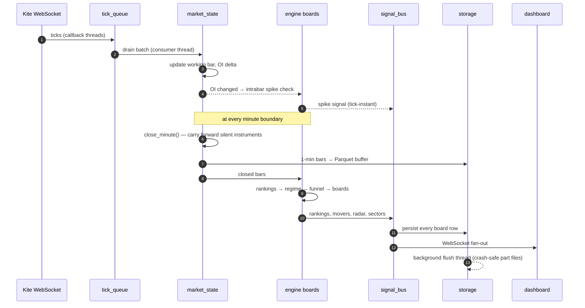
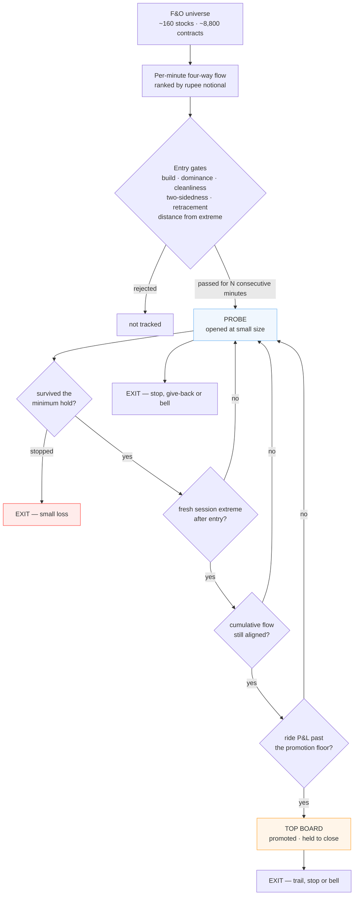

<div align="center">

# Clavis Terminal

**The key to understand F&O markets.**

A real-time open-interest intelligence terminal for the Indian derivatives market.
It watches the full option chain of the NSE F&O universe tick by tick, works out
where institutional money is actually being committed, and puts that on a screen
while the session is still running.

[](https://www.python.org/)
[](https://fastapi.tiangolo.com/)
[](https://nextjs.org/)
[](https://www.typescriptlang.org/)
[](https://kite.trade/)
[](https://parquet.apache.org/)
[](LICENSE)


</div>

---

## Table of contents

- [Why this exists](#why-this-exists)
- [What the terminal does](#what-the-terminal-does)
- [System architecture](#system-architecture)
- [The per-minute engine loop](#the-per-minute-engine-loop)
- [The conviction funnel](#the-conviction-funnel)
- [Repository layout](#repository-layout)
- [Data model](#data-model)
- [API surface](#api-surface)
- [Getting started](#getting-started)
- [Daily operating procedure](#daily-operating-procedure)
- [Offline replay and validation](#offline-replay-and-validation)
- [Production engineering](#production-engineering)
- [Scale and performance](#scale-and-performance)
- [What is not in this repository](#what-is-not-in-this-repository)
- [Roadmap](#roadmap)
- [Note on the published source](#note-on-the-published-source)
- [Disclaimer](#disclaimer)

---

## Why this exists

Open interest is the only public number that tells you how much money is
*committed* to a position rather than merely traded through it. The problem is
that it is published as a raw total, per contract, with no direction attached -
every open contract has a buyer and a seller. Screeners that rank stocks by "OI
change" therefore rank noise.

Clavis Terminal treats OI as a flow problem instead of a level problem. For
every contract in the universe it builds one-minute bars, measures the change in
open interest against that contract's own recent behaviour, pairs the change
with the simultaneous price change to infer *which side* initiated it, converts
it into rupee notional, and aggregates it per stock. Fresh call buying and put
writing are bullish commitment; put buying and call writing are bearish
commitment; unwinding and short covering are exit flows and are tracked
separately. That four-way decomposition is what the whole terminal is built on.

The design constraint throughout is that a retail trader has to be able to run
it: one machine, one broker API key, three WebSocket connections, no
co-location, and everything has to stay explainable on screen.

---

## What the terminal does

### Live ingestion
- Resolves the nearest-expiry option chain plus near-month futures for every
  symbol in `stocks.txt` from the daily NFO instrument dump.
- Trims the universe to fit the broker's hard cap of 3 WebSocket connections
  x 3,000 instruments, dropping the furthest out-of-the-money strikes first.
- Subscribes in full mode and builds one-minute OHLCV + OI bars for roughly
  8,800 instruments concurrently.

### OI flow analytics
- **Four-way flow decomposition** - every OI change is classified as long
  build-up, short build-up, short covering or long unwinding, mapped onto
  bullish / bearish commitment, and weighted by rupee notional.
- **Spike detection on two paths** - an O(1) intrabar path that fires the moment
  an OI tick lands, and a full sweep at every minute close. A spike needs a
  z-score against the contract's own trailing baseline, a minimum percentage OI
  move, a minimum OI base and real traded volume, with a per-instrument cooldown.
- **Roll-aware netting** - a same-side unwind at one strike paired with a build
  at a further strike is a position roll, not new money, and is netted out.

### Boards on the screen
| Board | What it answers |
|---|---|
| **Conviction Funnel** | Which stocks are being accumulated one-directionally right now, which of those have proven themselves, and how close each is to promotion or removal |
| **OI Build-up Ranking** | Which stocks lead the universe on buy-side and write-side option flow this minute, in rupee crore |
| **Big Player Radar** | Where near-spot strike OI is building faster than that contract's own normal pace |
| **Position Radar** | Per stock, where in the chain size is being accumulated, and whether the stock is loaded but still quiet or already moving |
| **OI Build-up Multiple** | Today's fresh OI against the prior session's closing OI, ranked by multiple rather than by absolute size |
| **Sector Leaders** | The strongest NSE sector indices and the one-way leaders inside them |
| **Relative Strength Leaders** | The day's top relative-strength names, snapshotted once at a fixed decision time |
| **Signal Feed** | The raw spike stream, tick-instant, with z-score and OI percentage |

### Risk and state management
- Per-side and per-day entry budgets, scaled by a live day-regime read.
- Hard stops, structural stops, give-back trails and a forced end-of-day close.
- Advisory position-size multipliers that fall as the tape gets choppier.
- Every board's state is written to SQLite each minute, so any session can be
  reconstructed and audited after the close.

---

## System architecture

```mermaid
flowchart LR
    subgraph BROKER["Broker"]
        KWS["Kite WebSocket<br/>3 connections"]
        KREST["Kite REST<br/>instruments · historical · quote"]
    end

    subgraph INGEST["Ingestion"]
        TM["ticker_manager<br/>connection pool + watchdog"]
        TQ["tick_queue<br/>thread-safe bridge"]
        BF["backfill<br/>gap repair"]
    end

    subgraph CORE["Engine"]
        MS["market_state<br/>per-instrument live state"]
        BB["bar_builder<br/>1-min OHLCV + OI"]
        OE["oi_engine<br/>rolling deltas + z-scores"]
        CL["classifier<br/>4-way flow"]
        SD["spike_detector"]
        RK["ranking<br/>rupee notional per stock"]
        RG["regime<br/>TREND / MIXED / CHOP"]
        OW["oneway_momentum<br/>conviction funnel"]
        BR["boards<br/>radar · position · multiple · sectors"]
    end

    subgraph OUT["Fan-out"]
        BUS["signal_bus<br/>pub/sub"]
        ST["storage<br/>Parquet + SQLite"]
        API["FastAPI<br/>REST + WebSocket"]
        UI["Next.js dashboard"]
    end

    KWS --> TM --> TQ --> MS
    KREST --> BF --> MS
    KREST -.instrument dump.-> MS
    MS --> BB --> OE --> CL --> SD
    OE --> RK --> RG --> OW
    RK --> BR
    SD --> BUS
    OW --> BUS
    BR --> BUS
    BUS --> ST
    BUS --> API --> UI
```



The three layers are deliberately decoupled. The engine never knows a dashboard
exists - it publishes to `signal_bus`, and console printers, the SQLite store and
the API server are all just subscribers. Adding a Telegram sink or a broker
order router is a new subscriber, not an engine change.

---

## The per-minute engine loop



Latency note that matters for expectations: the exchange disseminates open
interest with a lag of one to three minutes. That is the floor for *any* OI
screener. Everything downstream of the tick is push-based and reacts in
microseconds, which is why the spike path is intrabar rather than
minute-batched - but no software can beat the dissemination lag.

---

## The conviction funnel

The central design decision of the terminal, and the one worth explaining in
full, is that **it does not try to pick winners at entry.**

Entry-time features do not separate stocks that go on to run from stocks that
fade. Build size, flow dominance and radar strength look statistically identical
at the entry minute for both groups. So the funnel does not predict - it
*confirms*.



Probes are cheap and numerous; the top board is small and expensive to reach. A
stock reaches it only by *continuing* - surviving, printing new extremes, keeping
its flow aligned and actually being in profit. Two live meters make the state
legible on screen: a **promotion energy bar** showing how many funnel legs a
probe has satisfied, and an **exit-risk meter** showing how close a ride is to
the nearest of its stop, its trail or the closing bell. Both are read-outs; they
drive nothing.

The day-regime meter sits above all of it, reading the cleanliness breadth of
the live futures tape and classifying the session as TREND, MIXED or CHOP. The
regime sets the daily entry budget per side, the advisory size multiplier and
the hard stop distance, and on a CHOP day it restricts entries to structural
setups only.

---

## Repository layout

```
clavis-terminal/
├── backend/
│   ├── main.py                  orchestrator: auth → universe → feed → loop → EOD
│   ├── api.py                   FastAPI REST + WebSocket bridge
│   ├── auth.py                  daily Kite login, token written to .env
│   ├── config.py                every path, window and threshold
│   ├── universe.py              option chain + futures resolution, capacity guard
│   ├── replay.py                offline replay of a recorded session
│   ├── stocks.txt               the monitored symbol list
│   ├── engine/
│   │   ├── market_state.py      per-instrument live state, session extremes, VWAP
│   │   ├── bar_builder.py       1-minute OHLCV + OI bars
│   │   ├── oi_engine.py         rolling OI deltas and z-scores
│   │   ├── classifier.py        OI + price → build-up / unwinding types
│   │   ├── spike_detector.py    composite spike signals
│   │   ├── ranking.py           four-way flow, roll-aware netting, rupee notional
│   │   ├── filters.py           straddle pin, OI wall runway, VWAP, relative volume
│   │   ├── regime.py            TREND / MIXED / CHOP day meter
│   │   ├── oneway_momentum.py   the conviction funnel (reference implementation)
│   │   ├── big_player_radar.py  near-spot strike build pace
│   │   ├── position_radar.py    per-stock accumulation map
│   │   ├── oi_multiple.py       today's OI vs prior EOD, ranked by multiple
│   │   ├── rs_leaders.py        relative-strength leaders (shadow board)
│   │   └── sector_leaders.py    sector rotation leaders (shadow board)
│   ├── feed/
│   │   ├── ticker_manager.py    3-connection WebSocket pool, reconnect, watchdog
│   │   ├── tick_queue.py        thread-safe callback → engine bridge
│   │   └── backfill.py          historical REST gap repair
│   ├── sinks/
│   │   ├── signal_bus.py        pub/sub hub + console printers
│   │   ├── storage.py           Parquet bar writer + SQLite store with migrations
│   │   └── baselines.py         cross-day per-stock flow baselines
│   └── tests/
│       └── test_oneway.py       end-to-end smoke test of the funnel
├── dashboard/
│   ├── app/                     Next.js 14 App Router entry, layout, global styles
│   ├── components/              one component per board
│   ├── hooks/
│   │   ├── useWebSocket.ts      reconnecting client with backoff
│   │   └── useLiveData.ts       reducer mapping socket frames → app state
│   └── lib/                     shared types and demo-mode fixtures
└── docs/assets/                 diagrams and preview art
```

---

## Data model

### Recorded bars - Parquet

`backend/data/bars/{YYYY-MM-DD}/part_####.parquet`

Written by a buffered background thread into numbered part files, so an
unexpected shutdown at any point costs at most one flush interval and never
corrupts an existing part. Each row is one instrument-minute:

| column | meaning |
|---|---|
| `minute` | bar timestamp |
| `token`, `tradingsymbol`, `underlying`, `kind`, `strike`, `expiry` | instrument identity |
| `open`, `high`, `low`, `close` | price |
| `volume`, `oi`, `oi_delta` | traded volume, open interest, change in OI |
| `backfilled` | set when the row was repaired from historical REST rather than the live feed |

### Signals and boards - SQLite (WAL)

`backend/data/signals/signals.sqlite`

| table | contents |
|---|---|
| `signals` | every fired spike, with score, z-score and OI percentage |
| `rankings` | the per-minute per-stock flow ranking snapshot |
| `oneway_movers` | funnel rows: entries, open minutes, promotions and exits |
| `big_player_radar` | near-spot build-pace flags |
| `position_builds` | per-stock accumulation state |
| `oi_multiple_board` | OI multiple rows against the prior EOD base |
| `sector_leaders`, `rs_leaders` | shadow board snapshots |
| `trade_ideas`, `momentum_picks`, `early_entries`, `best_picks` | earlier generations of the decision surface, retained for audit |
| `feed_gaps` | recorded outage windows, so later analysis knows which minutes are artifact |

Schema changes ship as additive `PRAGMA table_info` + `ALTER TABLE` migrations
that run at startup, so an existing database is never rebuilt or lost.

### Session metadata

`backend/data/meta/` holds the daily instrument snapshot, per-token day
references (previous close and exchange open, learned from live ticks), the
prior-session end-of-day OI snapshot, the single-instance lock, and
`flow_baseline.csv` - a trailing-window median of each stock's own typical
minute flow. That last file is what makes "unusual **for this stock**"
meaningful: a mid-cap building four times its own normal pace is a signal, while
the same rupee figure in a large-cap bank is an ordinary Tuesday.

---

## API surface

FastAPI, started in-process with the screener via `--api`.

### REST

| method | route | returns |
|---|---|---|
| `GET` | `/api/status` | market open, instrument count, signals today, feed health |
| `GET` | `/api/signals/today` | today's spike signals |
| `GET` | `/api/rankings/latest` | most recent per-stock flow ranking |
| `GET` | `/api/oneway/latest` | current funnel state - top board and probes |
| `GET` | `/api/radar/latest` | near-spot build-pace flags |
| `GET` | `/api/position/latest` | per-stock accumulation map |
| `GET` | `/api/oimult/latest` | OI multiple board |
| `GET` | `/api/sector/latest` | sector leader board |

### WebSocket

`ws://localhost:8000/ws/live`

Sends a full state snapshot on connect, then incremental frames. The bridge
moves rows from the synchronous engine thread onto an asyncio queue and fans
them out to every connected browser at a fixed tick, with a periodic status
frame so the dashboard's LIVE indicator flips at the open and the close without
needing a reconnect.

```jsonc
{ "type": "status",   "data": { "market_open": true, "instruments": 8812, "feed_down": false } }
{ "type": "ranking",  "data": [ /* per-stock flow rows */ ] }
{ "type": "oneway",   "data": [ /* funnel rows */ ] }
{ "type": "signal",   "data": { /* one spike */ } }
{ "type": "radar",    "data": [ /* near-spot flags */ ] }
{ "type": "sector",   "data": [ /* sector leaders */ ] }
```

---

## Getting started

### Prerequisites

- Python 3.11 or newer
- Node.js 18 or newer
- A **Kite Connect** subscription with API key and secret ([kite.trade](https://kite.trade/))

### 1. Backend

```bash
git clone https://github.com/<your-user>/clavis-terminal.git
cd clavis-terminal/backend

python -m venv .venv
# Windows
.venv\Scripts\activate
# macOS / Linux
source .venv/bin/activate

pip install -r requirements.txt
```

Create `backend/.env` from the template and fill in your own credentials:

```bash
cp .env.example .env
```

```ini
KITE_API_KEY=your_api_key
KITE_API_SECRET=your_api_secret
KITE_ACCESS_TOKEN=
```

> `.env` is git-ignored and must stay that way. `KITE_ACCESS_TOKEN` is written
> automatically by `auth.py` - leave it blank.

Choose the symbols to monitor by editing `backend/stocks.txt`, one NSE F&O
underlying per line. The universe builder will report any symbol it cannot
resolve in the instrument dump.

Verify the engine before pointing it at a live market:

```bash
python -m tests.test_oneway
```

### 2. Dashboard

```bash
cd ../dashboard
npm install
```

Create `dashboard/.env.local`:

```ini
NEXT_PUBLIC_DEMO=false
NEXT_PUBLIC_API_WS=ws://localhost:8000/ws/live
```

Set `NEXT_PUBLIC_DEMO=true` to explore the interface with generated fixture data
and no backend running.

```bash
npm run build
npm run start          # http://localhost:3000
```

Use `npm run dev` only while editing the interface. Development mode ships an
unoptimised React build and visibly lags a live session with this many rows per
second; live use runs the production build.

---

## Daily operating procedure

```mermaid
gantt
    title Trading day
    dateFormat HH:mm
    axisFormat %H:%M
    section Pre-market
    python auth.py            :done, a, 08:45, 5m
    python main.py --api      :active, b, 09:05, 10m
    npm run start             :active, c, 09:05, 10m
    section Session
    Feed live, boards update  :d, 09:15, 375m
    Prime detection window    :crit, e, 09:25, 55m
    section Post-market
    EOD flush + finalize      :f, 15:30, 5m
    Replay and review         :g, 15:40, 30m
```



```bash
# 1. Broker access tokens expire daily, around 07:30 IST.
#    Log in once and paste the request_token back into the prompt.
python auth.py

# 2. Start the screener before the bell. It waits for 09:15 by itself.
python main.py --api                 # add --now to start immediately
python main.py --api --api-port 8000 # explicit port
python main.py --api --no-warm       # skip rebuilding state from today's bars

# 3. Serve the dashboard from the production build.
cd ../dashboard && npm run start
```

**Start before 09:10.** Option contracts cannot be backfilled once the session
is running, so a late start permanently loses the opening window - which is
exactly the window the funnel's earliest entry paths depend on. `main.py` warns
loudly when it detects a late start, and the day-regime meter caps the session
at MIXED rather than reporting a trend it never actually observed.

**Run one instance.** A single screener consumes all three WebSocket
connections the broker allows per API key. A second process would silently split
the universe between two terminals showing different partial data, so startup
takes a single-instance lock and refuses to run twice.

---

## Offline replay and validation

Every session is recorded in full, which means the engine can be re-run over any
recorded day with no market and no broker connection.

```bash
python replay.py --date 2026-01-15                  # replay a recorded day
python replay.py --date 2026-01-15 --rank-every 5   # ranking cadence, minutes
python replay.py --date 2026-01-15 --save           # persist replayed output
python replay.py --date 2026-01-15 --save-baseline  # rebuild flow baselines
```

Replay drives exactly the same engine objects as live trading - the same
`market_state`, the same ranking pass, the same funnel - so a threshold change
can be evaluated against real recorded market behaviour rather than against
synthetic data. That distinction is not academic: a synthetic feed can ramp open
interest in ways real strikes never do, and rules that pass a synthetic test can
be mathematically impossible on live data. Replay also produces a forward-return
report, measuring what price did in the window after each signal fired.

---

## Production engineering

This is a system that has to survive a live market session unattended, so a
large part of it is failure handling rather than analytics.

| Concern | How it is handled |
|---|---|
| **Feed stall** | A watchdog tracks time since the last tick. Past the stale threshold it forces a reconnect, retries a bounded number of times, then re-checks the access token and raises a `feed_down` banner on the dashboard instead of silently showing stale numbers. |
| **Gap repair** | Once the feed returns, futures minute bars for the outage window are refetched from the historical REST API, rate-limited to the broker's ceiling, and spliced into the recorded bars. Repaired rows are flagged `backfilled`, and the outage window is recorded in `feed_gaps` so later analysis knows which minutes are artifact. |
| **Crash safety** | Bars are buffered and flushed by a background thread into numbered part files on a short interval. A hard kill loses at most one interval, and never a previously written part. |
| **Mid-day restart** | On boot the engine reads back today's already-recorded bars and rebuilds in-memory state - session extremes, baselines, cumulative flow - before resuming the live feed, so a restart does not reset the day. |
| **Double-run** | A PID-checked lock file in `data/meta/`. A stale lock from a crashed run is detected and taken over; a genuinely running second instance is refused. |
| **Schema drift** | SQLite migrations are additive and idempotent, checked against `PRAGMA table_info` at startup. Databases from earlier versions keep working. |
| **Silent instruments** | Illiquid strikes that trade nothing for a minute would otherwise leave holes in the time series. `close_minute` carries them forward so every instrument has a continuous bar series. |
| **Day references** | Previous close and exchange open are learned from full-mode ticks and persisted per token, so day-percentage figures match what a broker terminal shows rather than drifting from a first-seen price. |
| **End of day** | A finalizer flushes remaining bars, writes an EOD OI snapshot for tomorrow's multiple board, appends the day's flow baselines, then runs `ANALYZE`, `optimize` and `VACUUM` and prints per-table row counts as a completeness receipt. |
| **Secrets** | Credentials live only in `backend/.env`, which is git-ignored. Nothing in the repository ever contains a key, and `auth.py` writes the daily token back to `.env` rather than to any tracked file. |

---

## Scale and performance

| Dimension | Figure |
|---|---|
| Instruments streamed concurrently | ~8,800 (3 connections x 3,000 cap, with headroom) |
| Underlyings tracked | ~160 NSE F&O names |
| Bars produced per session | ~3.3 million instrument-minutes |
| Spike detection latency | microseconds after an OI tick lands, intrabar |
| Ranking / funnel cadence | every minute, full universe |
| Dashboard fan-out | fixed-rate WebSocket push to all connected clients |
| Hardware | a single desktop machine |

The engine is single-process by design. Broker WebSocket callbacks run on their
own threads and hand ticks to a thread-safe queue; one consumer thread owns all
mutable state, which removes an entire class of concurrency bug. Z-scores are
computed against cached rolling mean and standard deviation, so the per-tick
check is O(1) rather than a window recomputation, which is what makes intrabar
detection across the full universe affordable.

---

## What is not in this repository

This project runs a real trading desk. The parts that constitute the actual edge
are withheld deliberately, and the repository is honest about where the gaps are
rather than pretending they do not exist.

- **The decision engines ship as reference implementations.** Each has the same
  public surface as production, produces the same shape of output, passes the
  same smoke test and drives the entire downstream stack end to end:

  | module | what the reference version omits |
  |---|---|
  | `engine/oneway_momentum.py` | the alternative entry paths that open the opening window, the structure machine behind them, structural stop placement, and the ordering and interaction of the gates |
  | `engine/big_player_radar.py` | strike weighting, pace normalisation and the strength curve |
  | `engine/position_radar.py` | the flow-acceleration breakout rule, its agreement conditions and re-arm behaviour |
  | `engine/oi_multiple.py` | baseline selection, near-spot weighting, the writer read and the counter-tape flag |
  | `engine/rs_leaders.py` | qualification gates and snapshot timing |
  | `engine/sector_leaders.py` | sector-strength weighting and leader qualification |

- **Calibrated thresholds are replaced with neutral reference defaults.** The
  `OW_*`, `CONV_*`, `LOADER_*`, `NR_*`, `SQZ_*` and `REGIME_*` blocks in
  `config.py` keep every parameter name, so the architecture reads correctly and
  the code runs, but the values are not the ones fitted on recorded sessions.
- **No recorded market data, research notebooks or session logs are included.**

Everything else - ingestion, universe construction, bar building, the four-way
flow decomposition, spike detection, ranking, storage, migrations, replay, the
API and the entire dashboard - is complete and runnable.

---

## Roadmap

### Near term

- **Broader entry coverage.** The funnel currently gets a minority of each day's
  genuine movers into the probe list. Missed movers are missed edge, since the
  profitable part of a ride happens before promotion. The open problem is
  admitting more of the right names during the opening window without simply
  buying tops - momentum-style entry at session extremes has been tested and
  loses money, so the answer has to be a different family of entry model.
- **Opening-window regime detection.** The regime meter is reliable by
  mid-morning but thin in the first half hour, which is when its throttle would
  be worth the most. Better opening tells - gap-hold breadth, cross-sectional
  dispersion, sector concentration - would compound through every other decision.
- **Direction-aware regime.** The meter currently reads trend strength without
  reading trend *side*, so a strongly one-directional tape can green-light
  full-size entries in the wrong direction. Index-relative rather than absolute
  reasoning is the fix.
- **Unwind-flow framework.** Build-up metrics are blind to moves driven by
  trapped writers covering, where open interest *falls* while price runs. The
  squeeze path addresses part of this; a principled treatment of exit flow as a
  first-class signal would cover the rest.
- **Paper-trade execution log.** A shadow order book that records the exact
  contract, entry, stop and exit each signal implies, so slippage and option
  convexity are measured rather than assumed.

### Medium term

- **Supervised learning layer.** Every per-minute engine metric is already
  recorded, which makes the archive a labelled training set. The intended shape
  is gradient-boosted trees under walk-forward validation, learning selectively
  from clean movers only, gated so that the model advises over explicit rules
  rather than replacing them. The design constraint is non-negotiable: an entry
  the trader cannot explain is an entry the system does not take.
- **Multi-session ensemble.** A regime classifier trained across many recorded
  sessions rather than the current live heuristic.
- **Automated post-session audit.** A generated report per day - which signals
  fired, which were taken, what each returned, which gate rejected each of the
  day's movers - so tuning is driven by evidence instead of recollection.

### Scaling the platform

- **Split the process.** Ingestion, analytics and API are logically separate
  already, communicating only through the bus. Promoting the bus to Redis
  Streams or NATS would let ingestion, engine and API run as independent
  services, add horizontal fan-out for multiple dashboards, and let the analytics
  layer restart without dropping the feed.
- **Columnar time-series storage.** Parquet plus SQLite is right for one machine
  and one year. ClickHouse or TimescaleDB would make cross-session queries over
  tens of millions of instrument-minutes interactive rather than batch.
- **Beyond one API key.** The 3 x 3,000 instrument ceiling is the binding
  constraint on universe size. Sharding the universe across multiple keyed
  workers, each publishing into a shared bus, lifts it - along with index option
  chains, which are currently out of scope.
- **Containerised deployment.** A Docker Compose stack for engine, API and
  dashboard, with a scheduled pre-market job that runs authentication and a
  health check before the bell instead of relying on the operator remembering.
- **Alerting fan-out.** Telegram, webhook and mobile push subscribers on the same
  bus, so the terminal does not have to be on screen to be useful.
- **Broker-agnostic feed adapter.** The ingestion layer is the only part coupled
  to a specific broker. An adapter interface behind `feed/` would let the same
  engine run on a different data source, or against a simulated feed for
  continuous integration.

---

## Note on the published source

> **The core decision logic of this system is intentionally not published here.**

This repository is the architecture, the infrastructure and the analytics
platform - not the strategy. To state it plainly, so nobody has to guess:

- **The production entry, exit and promotion engine is withheld.** Every
  decision engine in `engine/` ships as a **reference implementation**: same
  public interface, same output shape, fully runnable, deliberately simpler.
  The rules that actually decide what gets bought and when are not in this code.
- **The calibrated thresholds are withheld.** Every parameter name is present so
  the design reads correctly, but the numbers are neutral reference defaults.
  They are not the values fitted on real recorded sessions.
- **The recorded market data is withheld.** No session recordings, no
  baselines, no research notebooks, no trade logs, no backtest output.
- **No credentials of any kind appear anywhere in this repository**, in any
  commit, at any point in its history.

What *is* complete and genuinely runnable: live ingestion across the full option
chain, universe construction under the broker's connection limits, bar building,
the four-way OI flow decomposition, spike detection, ranking, persistence and
migrations, offline replay, the REST and WebSocket API, and the entire terminal
interface. Clone it, add your own API key and your own rules, and it runs.

The withheld parts were built and validated over live trading sessions. They
stay private. Everything published here is offered as-is under the MIT licence.

---

## Disclaimer

This software is a market-analysis and research tool. It is not investment
advice, it does not place orders, and nothing in this repository is a
recommendation to buy or sell any security. Derivatives trading carries
substantial risk of loss. Anyone running this code does so on their own account
and at their own risk.

---

<div align="center">

Built for the Indian F&O market. MIT licensed - see [LICENSE](LICENSE).

</div>
